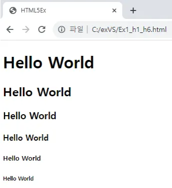
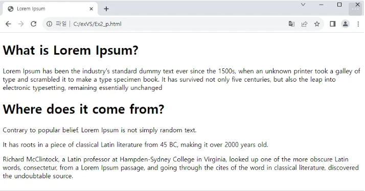
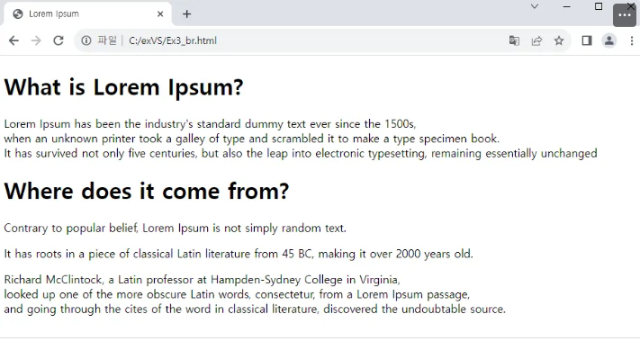
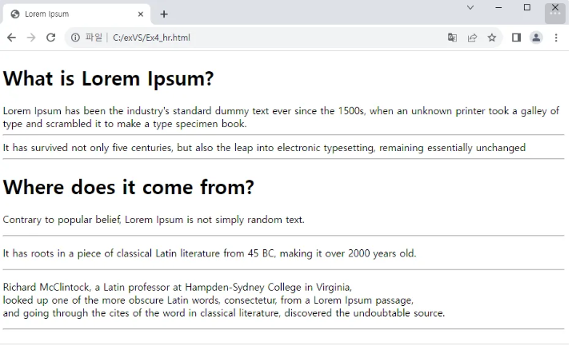
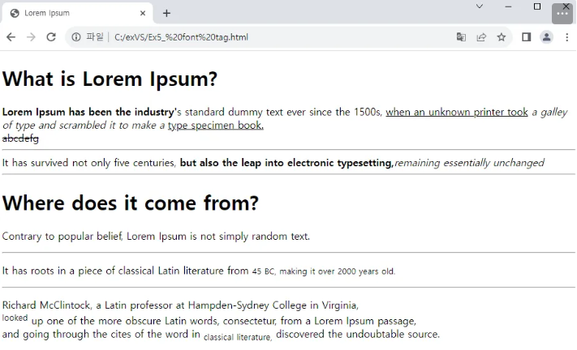
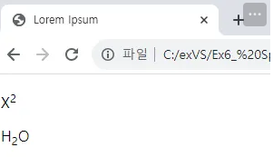
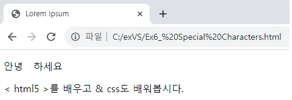
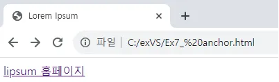
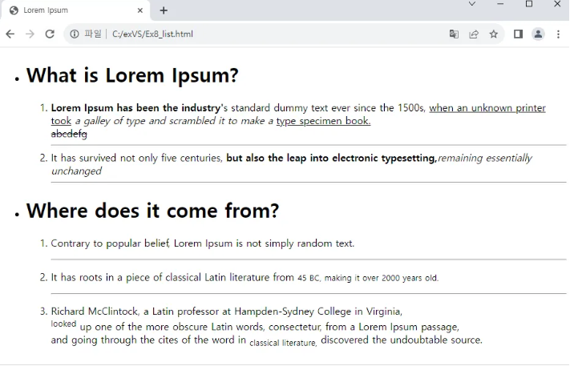

## body 태그 :
웹 페이지의 실제 내용을 포함하며, 브라우저에서 보여지는 모든 콘텐츠가 태그 안에 위치하며 웹 페이지의 텍스트, 이미지, 비디오, 링크, 버튼 등 사용자가 볼 수 있는 모든 요소는 body 태그로 이루어 진다.

## hody태그 내부에 포함되는 요소 

## 글자 태그

### h1 ~ h6 : 
제목을 표현하며 h1, h2, h3, h4. h5, h6 순으로 더 작은 제목으로 표현됨

```html
<!DOCTYPE html>
<html lang="en">
<head>
    <meta charset="UTF-8">
    <meta name="viewport" content="width=device-width, initial-scale=1.0">
    <title>HTML5Ex</title>
</head>
<body>
    <h1>Hello World</h1>
    <h2>Hello World</h2>
    <h3>Hello World</h3>
    <h4>Hello World</h4>
    <h5>Hello World</h5>
    <h6>Hello World</h6>
</body>
</html>
```
<!--  -->

<!--  -->
___

### p : 본문을 작성할 때 사용되며 문단 형태의 글을 표현한다.

```html
<!DOCTYPE html>
<html lang="en">
<head>
    <meta charset="UTF-8">
    <meta name="viewport" content="width=device-width, initial-scale=1.0">
    <title>Lorem Ipsum</title>
</head>
<body>
    <h1>What is Lorem Ipsum?</h1>
    Lorem Ipsum has been the industry's standard dummy text ever since the 1500s, 
    when an unknown printer took a galley of type and scrambled it to make a type specimen book. 
    It has survived not only five centuries, but also the leap into electronic typesetting, remaining essentially unchanged
    
    <h1>Where does it come from?</h1>
    <p>Contrary to popular belief, Lorem Ipsum is not simply random text.</p> 
    <p>It has roots in a piece of classical Latin literature from 45 BC, making it over 2000 years old.</p>
    <p>Richard McClintock, a Latin professor at Hampden-Sydney College in Virginia, looked up one of the more obscure Latin words, 
    consectetur, from a Lorem Ipsum passage, and going through the cites of the word in classical literature, 
    discovered the undoubtable source. 
    </p>
</body>
</html>
```

<!--  -->

<!--  -->
___

### br : 줄 바꿈

```html
<!DOCTYPE html>
<html lang="en">
<head>
    <meta charset="UTF-8">
    <meta name="viewport" content="width=device-width, initial-scale=1.0">
    <title>Lorem Ipsum</title>
</head>
<body>
    <h1>What is Lorem Ipsum?</h1>
    Lorem Ipsum has been the industry's standard dummy text ever since the 1500s,
    when an unknown printer took a galley of type and scrambled it to make a type specimen book. 
    <br>
    It has survived not only five centuries, but also the leap into electronic typesetting, remaining essentially unchanged
    
    <h1>Where does it come from?</h1>
    <p>Contrary to popular belief, Lorem Ipsum is not simply random text.</p> 
    <p>It has roots in a piece of classical Latin literature from 45 BC, making it over 2000 years old.</p>
    <p>Richard McClintock, a Latin professor at Hampden-Sydney College in Virginia, <br>looked up one of the more obscure Latin words, 
    consectetur, from a Lorem Ipsum passage, <br>and going through the cites of the word in classical literature, 
    discovered the undoubtable source.
    </p>
    
</body>
</html>
```
<!--  -->

<!--  -->
___

### hr : 수평 줄 삽입 

```html
<!DOCTYPE html>
<html lang="en">
<head>
    <meta charset="UTF-8">
    <meta name="viewport" content="width=device-width, initial-scale=1.0">
    <title>Lorem Ipsum</title>
</head>
<body>
    <h1>What is Lorem Ipsum?</h1>
    Lorem Ipsum has been the industry's standard dummy text ever since the 1500s,
    when an unknown printer took a galley of type and scrambled it to make a type specimen book. 
    <br>
    <hr>
    It has survived not only five centuries, but also the leap into electronic typesetting, remaining essentially unchanged
    <hr>
    
    <h1>Where does it come from?</h1>
    <p>Contrary to popular belief, Lorem Ipsum is not simply random text.</p> 
    <hr>
    <p>It has roots in a piece of classical Latin literature from 45 BC, making it over 2000 years old.</p>
    <hr>
    <p>Richard McClintock, a Latin professor at Hampden-Sydney College in Virginia, <br>looked up one of the more obscure Latin words, 
    consectetur, from a Lorem Ipsum passage, <br>and going through the cites of the word in classical literature, 
    discovered the undoubtable source.
    <hr>
    </p>
    
</body>
</html>
```
<!--  -->

<!--  -->
___

## 글자 모양 태그 

### b : 텍스트를 굵게 표시
### i : 텍스트를 이탤릭체(서예 글씨)로 표시 
### u : 텍스트 밑줄 표시
### ins : 텍스트 밑줄 표시
### del : 텍스트 취소(줄) 표시
### strong : 텍스트 강조 표시(굵게)
### em : 텍스트를 기울임체로 강조 표시(얇게)
### small : 작은 텍스트로 표시
### sup : 위 첨자(텍스트를 위쪽으로 작게 표시)
### sub : 아래 첨자(텍스트를 아래쪽으로 작게 표시)
___

```html
<!DOCTYPE html>
<html lang="en">
<head>
    <meta charset="UTF-8">
    <meta name="viewport" content="width=device-width, initial-scale=1.0">
    <title>Lorem Ipsum</title>
</head>
<body>
    <h1>What is Lorem Ipsum?</h1>
    <b>Lorem Ipsum has been the industry'</b>s standard dummy text ever since the 1500s,
    <u>when an unknown printer took</u> <i>a galley of type and scrambled it to make a </i><ins>type specimen book.</ins>
    <br>
    <del>abcdefg</del> 
    <hr>
    It has survived not only five centuries, <strong>but also the leap into electronic typesetting,</strong><em>remaining essentially unchanged</em>
    <hr>
    
    <h1>Where does it come from?</h1>
    <p>Contrary to popular belief, Lorem Ipsum is not simply random text.</p> 
    <hr>
    <p>It has roots in a piece of classical Latin literature from <small>45 BC, making it over 2000 years old.</small></p>
    <hr>
    <p>Richard McClintock, a Latin professor at Hampden-Sydney College in Virginia, <br><sup>looked</sup> up one of the more obscure Latin words, 
    consectetur, from a Lorem Ipsum passage, <br>and going through the cites of the word in <sub>classical literature,</sub> 
    discovered the undoubtable source.
    </p>
</body>
</html>
```

<!--  -->

<!--  -->
  
```html
<!DOCTYPE html>
<html lang="en">
<head>
    <meta charset="UTF-8">
    <meta name="viewport" content="width=device-width, initial-scale=1.0">
    <title>Lorem Ipsum</title>
</head>
<body>
    <P>X<sup>2</sup></P>
    <p>H<sub>2</sub>O</p>
</body>
</html>
```
<!--  -->

<!--  -->
___


## 특수 문자 표시

### &nbsp; :  공백 표시
### &lt; : < 모양 표시
### &gt; : > 모양 표시
### &amp; : & 모양 표시
    
```html
    <!DOCTYPE html>
    <html lang="en">
    <head>
        <meta charset="UTF-8">
        <meta name="viewport" content="width=device-width, initial-scale=1.0">
        <title>Lorem Ipsum</title>
    </head>
    <body>
        <p>안녕 &nbsp; 하세요</p>
        <p>&lt; html5 &gt;를 배우고 &amp; css도 배워봅시다.</p>
    </body>
    </html>
```
<!--  -->

<!--  -->
___


## 링크 태그

### a : 
하이퍼링크(다른 웹페이지, 파일, 위치 등 이동할 수 있는 링크)를 생성하며 href 속성을 사용하여 하이퍼 링크의 주소를 표현한다.

```html
<!DOCTYPE html>
<html lang="en">
<head>
    <meta charset="UTF-8">
    <meta name="viewport" content="width=device-width, initial-scale=1.0">
    <title>Lorem Ipsum</title>
</head>
<body>
    <a href="https://www.lipsum.com/">lipsum 홈페이지</a>
</body>
</html>
```

<!--  -->

<!--  -->
___


## 목록 태그

### ul : 순서가 없는 목록 생성
### ol : 순서가 있는 목록 생성
### li : 목록의 항목 생성

```html
<!DOCTYPE html>
<html lang="en">

<head>
    <meta charset="UTF-8">
    <meta name="viewport" content="width=device-width, initial-scale=1.0">
    <title>Lorem Ipsum</title>
</head>

<body>
    <ul>
        <li>
            <h1>What is Lorem Ipsum?</h1>
        </li>
        <ol>
            <li>
                <b>Lorem Ipsum has been the industry'</b>s standard dummy text ever since the 1500s,
                <u>when an unknown printer took</u> <i>a galley of type and scrambled it to make a </i><ins>type specimen book.</ins>
                <br>
                <del>abcdefg</del>
                <hr>
            </li>
            
            <li>
                It has survived not only five centuries, <strong>but also the leap into electronic typesetting,</strong><em>remaining essentially unchanged</em>
                <hr>
            </li>
        </ol>
    </ul>

    <ul>
        <li>
            <h1>Where does it come from?</h1>
        </li>
        <ol>
            <p>
                <li>Contrary to popular belief, Lorem Ipsum is not simply random text.
            </p>
            </li>
            <hr>
            <p>
                <li>It has roots in a piece of classical Latin literature from <small>45 BC, making it over 2000 years old.</small>
            </p>
            </li>
            <hr>
            <p>
                <li>Richard McClintock, a Latin professor at Hampden-Sydney College in Virginia, <br><sup>looked</sup>
                    up one of the more obscure Latin words,
                    consectetur, from a Lorem Ipsum passage, <br>and going through the cites of the word in
                    <sub>classical literature,</sub>
                    discovered the undoubtable source.</li>
            </p>
        </ol>
    </ul>
</body>
</html>
```

<!--  -->

<!--  -->