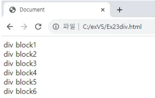
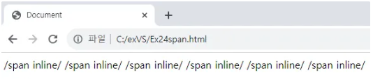

div : 
- 구획을 나누거나 그룹 화 할 때 사용된다. 
- 그룹화 하게 되면 그룹화 된 영역을 스타일링(CSS), 스크립팅(JS), 레이아웃을 구성하고 관리하는데 용이하다.

```html
<!DOCTYPE html>
<html lang="en">
<head>
    <meta charset="UTF-8">
    <meta name="viewport" content="width=device-width, initial-scale=1.0">
    <title>Document</title>
</head>
<body>
    <div>div block1</div>
    <div>div block2</div>
    <div>div block3</div>
    <div>div block4</div>
    <div>div block5</div>
    <div>div block6</div>
</body>
</html> 
```



span : 
- 텍스트나 이미 등의 인라인 요소를 그룹화 할 때 사용된다. 
- 인라인 요소를 그룹화 하여 <div>와 마찬가지로 스타일링(CSS), 스크립팅(JS), 레이아웃을 구성하고 관리하는데 용이하다.

```html
<!DOCTYPE html>
<html lang="en">
<head>
    <meta charset="UTF-8">
    <meta name="viewport" content="width=device-width, initial-scale=1.0">
    <title>Document</title>
</head>
<body>
    <span>/span inline/</span>
    <span>/span inline/</span>
    <span>/span inline/</span>
    <span>/span inline/</span>
    <span>/span inline/</span>
    <span>/span inline/</span>
</body>
</html> 
```




div, span 둘의 차이점 :

줌 바꿈 : div는 줄 바꿈이 되지만 span 태그는 줄 바꿈이 되지 않고 옆으로 붙는다.

영역을 지정하는 방식 : div태그는 텍스트를 표현할 때 사각형 박스로 구역을 정하지만 span은 문장 단위로 지정한다.

