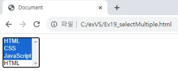

# input : 
사용자로부터 데이터를 입력 받는 데 사용되며 input 태그의 속성을 사용해 다양한 유형의 입력 필드를 생성하는데 사용된다.

웹 페이지에서 사용자가 원하는 컨텐츠를 제공하며 사용자와의 상호 작용을 가능하게 한다.

## input tag의 속성 : 

### text : 글자 입력 양식 생성

### button : 버튼

### checkbox : 체크 박스 생성

### file : 파일 입력 양식 생성

### hidden : 해당 내용 표시 하지 않음

### image : 이미지 형태 생성

### password : 비밀번호 입력 양식 생성

### radio : 라디오 버튼 생성

### reset : 초기화 버튼 생성

### submit : 제출 버튼 생성

```html
<!DOCTYPE html>
<html lang="en">
<head>
    <meta charset="UTF-8">
    <meta name="viewport" content="width=device-width, initial-scale=1.0">
    <title>input</title>
</head>
<body>
    <form>
        <input type="text" name ="text" value="text"><br>
        <input type="password" name="password" value="password"><br>
        <input type="file" name="file" value="file"><br>
        <input type="checkbox" name="checkbox" value="checkbox"><br>
        <input type="radio" name="radio" value="radio"><br>

        <input type="hidden" name="hidden" value="hidden"><br>

        <input type="button" value="button"><br>
        <input type="reset" value="reset"><br>
        <input type="submit" value="submit"><br>
        <input type="image" src="http://placehold.it/200x200">
    </form>
</body>
</html>
```

<!--  -->

<!--  -->
___


# textarea : 
여러 줄의 텍스트를 입력 받을 수 있는 태그 주로 긴 텍스트를 입력하거나 텍스트를 여러 줄에 걸쳐 표시할 때 사용할 상자를 생성한다.

## textarea의 속성 : 

### row : textarea로 만들어질 상자의 행 수를 지정한다.

### cols : textarea로 만들어질 상자의 열 수를 지정한다.

```html
<!DOCTYPE html>
<html lang="en">
<head>
    <meta charset="UTF-8">
    <meta name="viewport" content="width=device-width, initial-scale=1.0">
    <title>Document</title>
</head>
<body>
    <textarea rows="4" cols="50">
</body>
</html>
```

<!--  -->

<!--  -->
___


# select,  option : 
사용자에게 선택 옵션을 제공하는데 사용된다.

```html
<!DOCTYPE html>
<html lang="en">
<head>
    <meta charset="UTF-8">
    <meta name="viewport" content="width=device-width, initial-scale=1.0">
    <title>Document</title>
</head>
<body>
    <select>
        <option>HTML</option>
        <option>CSS</option>
        <option>JavaScript</option>
        <option>HTML</option>
    </select>
</body>
</html>
```

<!--  -->

<!--  -->
___

### select를 사용해서 항목 중 하나를 선택하는 화면을 구성하였는데 하나가 아닌 여러 항목을 선택하여야 할 경우에는 select 태그의 multiple 속성을 사용한다.

```html
<!DOCTYPE html>
<html lang="en">
<head>
    <meta charset="UTF-8">
    <meta name="viewport" content="width=device-width, initial-scale=1.0">
    <title>Document</title>
</head>
<body>
    <select multiple = "multiple">
        <option>HTML</option>
        <option>CSS</option>
        <option>JavaScript</option>
        <option>HTML</option>
    </select>
</body>
</html>
```

<!--  -->

<!--  -->
___


# optgroup : 
select, option 태그를 사용하여 만든 선택 가능 입력 양식을 그룹화 하여 표현한다.

```html
<!DOCTYPE html>
<html lang="en">
<head>
    <meta charset="UTF-8">
    <meta name="viewport" content="width=device-width, initial-scale=1.0">
    <title>Document</title>
</head>
<body>
    <select>
        <optgroup label="pront - end"> // 
            <option>HTML</option>
            <option>CSS</option>
            <option>JavaScript</option>
        </optgroup>
        <optgroup label="back - end">
            <p>back - end</p>
            <option>Java</option>
            <option>Python</option>
            <option>JavaScript</option>
        </optgroup>
    </select>
</body>
</html>
```

<!--  -->

<!--  -->
___


# fieldset : 
양식의 구조를 나누는 데 사용되며 일종의 컨테이너 역할을 하고 구조가 나눠진 양식에 대한 스타일링과 레이아웃을 일관되게 적용하는데 사용된다.

# legend : 
fieldset 태그에 대한 설명이나 제목을 제공한다.(다른 태그 내부에 사용할 경우 효과가 없음)

```html
<!DOCTYPE html>
<html lang="en">
<head>
    <meta charset="UTF-8">
    <meta name="viewport" content="width=device-width, initial-scale=1.0">
    <title>Document</title>
</head>
<body>
    <form>
        <fieldset>
            <legend >입력 양식</legend>
            <input type="text"><br>
            <input type="text"><br>
            <input type="text"><br>
            <input type="text"><br>
        </fieldset>
    </form>
</body>
</html>
```

<!--  -->

<!--  -->
___


# label : 다른 태그와 관계되어 관계된 태그에 대한 설명을 제공하고 의미를 부여하는데 사용된다.

```html
<!DOCTYPE html>
<html lang="en">
<head>
    <meta charset="UTF-8">
    <meta name="viewport" content="width=device-width, initial-scale=1.0">
    <title>Document</title>
</head>
<body>
    <form>
       <table>
        <tr>
            <td><label for="username">이름</label></td>
            <td><input id = "username" type="text" name="username"></td>
        </tr>
        <tr>
            <td>성별</td>
            <td>
                <input id = "man" type="radio" name="gender" value="m">
                <label for = "man">남자</label>
                <input id = "woman" type="radio" name="gender" value="w">
                <label for = "woman">여자</label>
            </td>
        </tr>
       </table>
       <input type="submit" value="가입">
    </form>
</body>
</html> 
```

<!--  -->

<!--  -->
___


## 종합 예제

```html
<!DOCTYPE html>
<html lang="en">
<head>
    <meta charset="UTF-8">
    <meta name="viewport" content="width=device-width, initial-scale=1.0">
    <title>입력폼 실습</title>
</head>
<body>
    <form action="https://search.naver.com/search.naver">
        <fieldset>
            <legend>네이버 검색</legend>
            <input type="text" name = "query" required="true">
            <button type="submit">검색</button>
        </fieldset>
    </form>

    <form action="" method="post">
        <fieldset>
            <legend>기본 정보</legend>
            <ul>
                <li>이름: <input name="name" type="text" placeholder="실명을 입력해주세요."> </li>
                <li>나이: <input name="age" type="number" value="0" min="0" max="200"> </li>
                <li>비밀번호: <input name="pw" type="password"></li>
            </ul>
        </fieldset>

        <fieldset>
            <legend>부가정보</legend>
            <li>
                거주지역
                <select name="loc" id="">
                    <option value="서울">서울</option>
                    <option value="경기">경기</option>
                    <option value="경상도">경상도</option>
                    <option value="제주도">제주도</option>
                </select>
            </li>
            <li>
                기술:
                <input type="checkbox" name="" id="cb1"> 
                <label for = "cb1">HTML</label>
                <input type="checkbox" name="" id="cb2"> 
                <label for = "cb2">CSS</label>
                <input type="checkbox" name="" id="cb3"> 
                <label for = "cb3">JS</label>
            </li>
            <li>
                과정:
                <input type="radio" name="과" id="rd1">
                <label for="">통학</label>
                <input type="radio" name="과" id="rd1">
                <label for="">기숙사</label>
                <input type="radio" name="과" id="rd1">
                <label for="">자퇴</label>
            </li>
        </fieldset>
        <button type="submit">제출</button>
    </form>
    
</body>
</html>
```

<!--  -->

<!--  -->