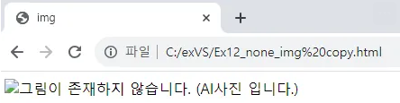

## media 태그 :  
### img : 이미지를 HTML문서(web page)에 삽입할 때 사용하며 아래와 같은 속성을 가진다.

## img태그의 속성 :
### src : 이미지의 경로 설정
### alt  : 이미지가 없을 때 나오는 글자 지정
### width : 이미지의 너비 지정
### height : 이미지의 높이 지정

```html
<!DOCTYPE html>
<html lang="en">
<head>
    <meta charset="UTF-8">
    <meta name="viewport" content="width=device-width, initial-scale=1.0">
    <title>img</title>
</head>
<body>
    
    
</body>
</html>
```

<!--  -->

<!--  -->
___

<!DOCTYPE html>
<html lang="en">
<head>
    <meta charset="UTF-8">
    <meta name="viewport" content="width=device-width, initial-scale=1.0">
    <title>img</title>
</head>
<body>
    
</body>
</html>

<!--  -->

<!--  -->
___

## audio : 오디오 파일을  HTML문서(web page)에 삽입할 때 사용하며 아래와 같은 속성을 가진다.
### src : 음악 파일의 경로 지정
### preload : 음악을 준비 중일 때 데이터를 모두 불러올지 여부 지정
### autoplay : 음악 자동 재생 여부 지정
### loop : 음악 반복 여부 지정
### controls : 음악 재생 도구 출력 여부 지정
___
## video :  비디오 파일을  HTML문서(web page)에 삽입할 때 사용하며 아래와 같은 속성을 가진다.
### src : 비디오 파일의 경로 지정
### preload : 비디오를 준비 중일 때 데이터를 모두 불러올지 여부 지정
### autoplay : 비디오 자동 재생 여부 지정
### loop : 비디오의 반복 여부 지정
### controls : 비디오 재생 도구 출력 여부 지정
### width : 비디오의 너비 지정
### height : 비디오의 높이 지정

___
HTML에서는 텍스트나 이미지, 입력 필드 등과 같은 요소들을 나타내기 위해 태그를 사용하는데 이 중 일부 태그는 단순히 하나의 요소만을 나타내고, 텍스와 같은 내용을 포함하지 않는 경우가 있는데 이런 경우 해당 태그는 닫힘 태그가 없이 사용하고 이것을 단일 태그라고 하며 br, img, input태그 등이 있다.

즉, br, img, input는 텍스트 입력과 같은 content를 입력하는 것이 아닌 다른 동작을 수행하기 때문에 닫힘 태그가 없는 것이다.