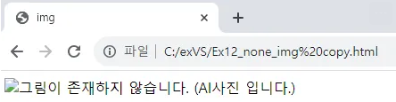

## table 태그
### table :  표 삽입 / border속성을 사용하여 표의 테두리 두께를 지정할 수 있다.
### tr : 표의 행 삽입
### th : 표의 제목 셀 생성 / colspan 속성 → 셀의 너비, rowspan 속성 → 셀의 높이를 설정할 수 있다.
### td : 표의 일반 셀 생성 / colspan 속성 → 셀의 너비, rowspan 속성 → 셀의 높이를 설정할 수 있다.

```html
<!DOCTYPE html>
<html lang="en">
<head>
    <meta charset="UTF-8">
    <meta name="viewport" content="width=device-width, initial-scale=1.0">
    <title>Document</title>
</head>
<style>
    table {
        border: 3px solid black;
        border-collapse: collapse;
    }

    td{
        border: 1px solid black;
        width: 100px;
        height: 100px;
        text-align: center;
        font-size: 20pt;
    }
</style>
<body>
    <table style="width: 50%;">
       
        <tr>
                <td colspan="5"></td>
        </tr>
        <tr>
                <td rowspan="4"></td>
                <td colspan="4"></td>
        </tr>
        <tr>
                <td></td>
                <td rowspan="2"></td>
                <td></td>
                <td rowspan="3"></td>
        </tr>
        <tr>
                <td></td>
                <td></td>
        </tr>
        <tr>
                <td colspan="2"></td>
                <td></td>
        </tr>
    </table>
</body>
</html>---
```

<!--  -->

<!--  -->

```html
<!DOCTYPE html>
<html lang="en">
<head>
    <meta charset="UTF-8">
    <meta name="viewport" content="width=device-width, initial-scale=1.0">
    <title>Document</title>
</head>
<style>
    table {
        border: 3px solid black;
        border-collapse: collapse;
    }

    td{
        border: 1px solid black;
        width: 100px;
        height: 100px;
        text-align: center;
        font-size: 20pt;
    }
</style>
<body>
    <table style="width: 50%;">
        <tr>
            <td></td>
            <td>월</td>
            <td>화</td>
            <td>수</td>
            <td>목</td>
            <td>금</td>
        </tr>

        <tr>
            <td>1교시</td>
            <td rowspan="3">Java</td>
            <td rowspan="2">HTML</td>
            <td colspan="3", rowspan="3">Spring</td>
        </tr>

        <tr>
            <td>2교시</td>
        </tr>

        <tr>
            <td>3교시</td>
            <td rowspan="3">CSS</td>
        </tr>

        <tr>
            <td>4교시</td>
            <td rowspan="2">JS</td>
            <td rowspan="4">JSP</td>
            <td colspan="2">GIT</td>
        </tr>

        <tr>
            <td>5교시</td>
            <td rowspan="3">CS</td>
            <td rowspan="3">React</td>
        </tr>

        <tr>
            <td>6교시</td>
            <td rowspan="2">DB</td>
            <td rowspan="2">JS</td>
        </tr>

        <tr>
            <td>7교시</td>
        </tr>
</table>
</body>
</html>
```

<!--  -->

<!--  -->

## media 태그 :  
### img : 이미지를 HTML문서(web page)에 삽입할 때 사용하며 아래와 같은 속성을 가진다.

## img태그의 속성 :
### src : 이미지의 경로 설정
### alt  : 이미지가 없을 때 나오는 글자 지정
### width : 이미지의 너비 지정
### height : 이미지의 높이 지정

<!DOCTYPE html>
<html lang="en">
<head>
    <meta charset="UTF-8">
    <meta name="viewport" content="width=device-width, initial-scale=1.0">
    <title>img</title>
</head>
<body>
    
    
</body>
</html>

<!--  -->

<!--  -->

<!DOCTYPE html>
<html lang="en">
<head>
    <meta charset="UTF-8">
    <meta name="viewport" content="width=device-width, initial-scale=1.0">
    <title>img</title>
</head>
<body>
    
</body>
</html>

<!--  -->

<!--  -->

## audio : 오디오 파일을  HTML문서(web page)에 삽입할 때 사용하며 아래와 같은 속성을 가진다.
### src : 음악 파일의 경로 지정
### preload : 음악을 준비 중일 때 데이터를 모두 불러올지 여부 지정
### autoplay : 음악 자동 재생 여부 지정
### loop : 음악 반복 여부 지정
### controls : 음악 재생 도구 출력 여부 지정

## video :  비디오 파일을  HTML문서(web page)에 삽입할 때 사용하며 아래와 같은 속성을 가진다.
### src : 비디오 파일의 경로 지정
### preload : 비디오를 준비 중일 때 데이터를 모두 불러올지 여부 지정
### autoplay : 비디오 자동 재생 여부 지정
### loop : 비디오의 반복 여부 지정
### controls : 비디오 재생 도구 출력 여부 지정
### width : 비디오의 너비 지정
### height : 비디오의 높이 지정

___
HTML에서는 텍스트나 이미지, 입력 필드 등과 같은 요소들을 나타내기 위해 태그를 사용하는데 이 중 일부 태그는 단순히 하나의 요소만을 나타내고, 텍스와 같은 내용을 포함하지 않는 경우가 있는데 이런 경우 해당 태그는 닫힘 태그가 없이 사용하고 이것을 단일 태그라고 하며 <br>, , <input>태그 등이 있다.

즉, <br>, , <input>는 텍스트 입력과 같은 content를 입력하는 것이 아닌 다른 동작을 수행하기 때문에 닫힘 태그가 없는 것이다.